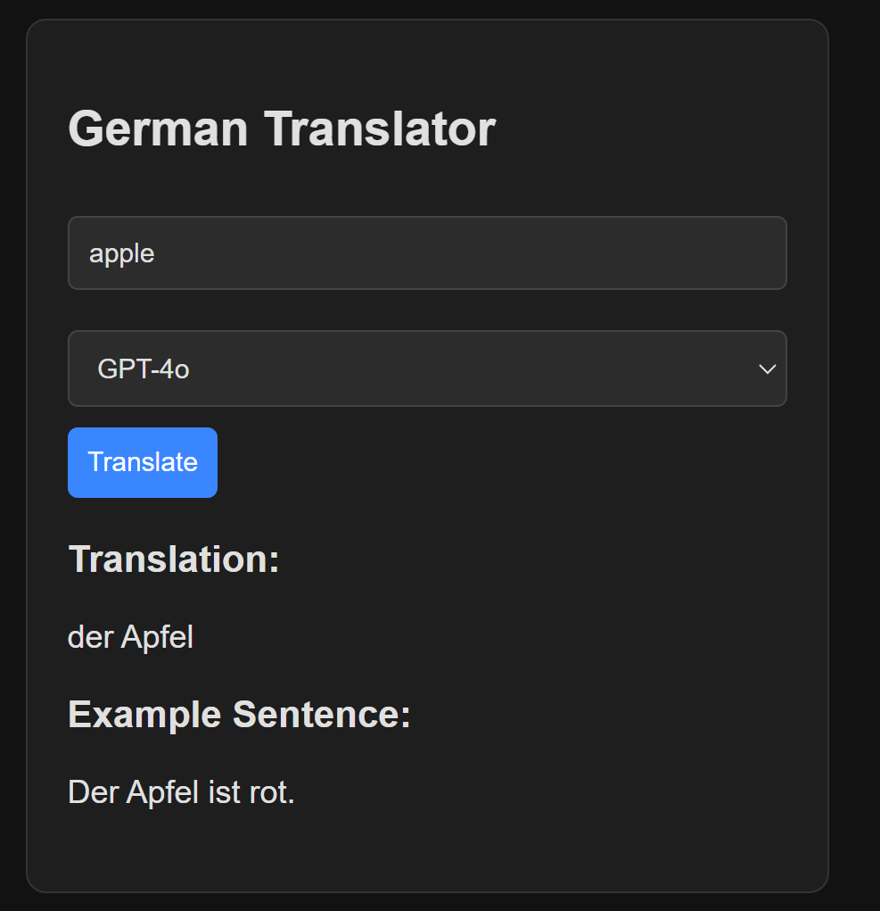
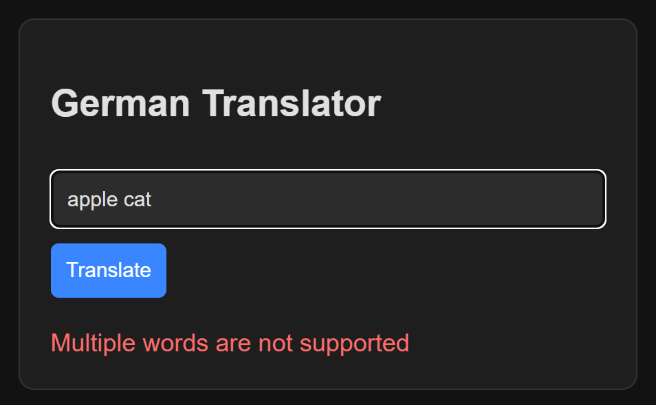

# german-translator

UI was created using [create-vite](https://vite.dev/guide/#scaffolding-your-first-vite-project) with `vanilla-ts` template

## Environment Setup

1. Install [Ollama](https://ollama.com/).
2. Pull the Llama 3.1 model: `ollama pull llama3.1`.
3. Install Python version 3.12.4.
4. Install Node.js version 20.18.0.
5. Create a Python virtual environment: `python -m venv env`.
6. Activate the Python virtual environment.
7. Install Python dependencies from the requirements file: `pip install -r requirements.txt`.
8. Navigate to the client directory and install client dependencies: `cd client && npm install`.
9. Start the client: `cd client && npm run dev`.
10. Launch the server: `uvicorn main:app --reload`.

